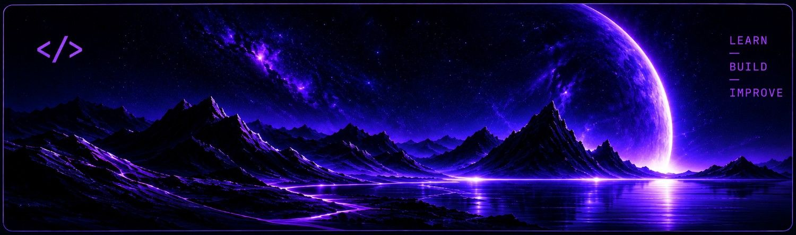

<div align="center">
  
</div> 

<h1>👋 Hey, I'm Reza Amini</h1>

<p>
  <strong>Full Stack Developer</strong>
  &nbsp; | &nbsp;
  <strong>Computer Engineering (IT)</strong>
</p>

<br>

```js
const developer = {
    name: "Reza Amini",
    role: "Full Stack Developer",
    education: "Computer Engineering (IT)",
    passion: "Turning ideas into working software",
    mindset: "Learn. Build. Improve.",
    currentlyLearning: "Always learning something new",
    funFact: "It's wrong. It works. Don't touch it. 😂"
};

console.log("Thanks for visiting my profile! 🚀");
```

<br>

## ⚡ Tech Stack

<div>
<kbd>
  
</kbd>
<kbd>
  
</kbd>
<kbd>
  
</kbd>
<kbd>
  
</kbd>
<kbd>
  
</kbd>

<!-- <br> -->
<kbd>
  
</kbd>
<kbd>
  
</kbd>
<kbd>
  
</kbd>
<kbd>
  
</kbd>
<kbd>
  
</kbd>
<kbd>
  
</kbd>

<!-- <br> -->
<kbd>
  
</kbd>
<kbd>
  
</kbd>
<kbd>
  
</kbd>
<kbd>
  
</kbd>
<kbd>
  
</kbd>

</div>


<!-- <div align="center">

---

`Learn` &nbsp; • &nbsp; `Build` &nbsp; • &nbsp; `Improve`

</div> -->
